# KL vs OT in Offline RL Is a Trust-Allocation Problem (Q vs BC Prior)

Date: 2026-03-02

## Executive Summary
This study supports a regime-based view instead of a global winner/loser claim.

- When Q is reliable, KL (especially Forward KL with Q-tilting) is strong.
- As Q quality degrades (high noise, low SNR), the best policy shifts toward trusting the behavior prior.
- In the harsh low-SNR + high-noise regime, Unbalanced OT (UOT) with small lambda outperforms both KL baselines.
- The key decision variable is not "KL vs OT" in isolation, but **how much to trust Q vs BC prior**.

---

## 1) What the Current Results Say (Sharpened)

### A. Trust sweep: Forward KL optimum moves toward BC as Q noise increases
From `hypothesis_trust_best_by_noise.csv`:

| Q noise std | Method | Best trust ratio (Q / BC) | Best mean reward |
|---:|---|---:|---:|
| 0.5 | Forward KL | 2.0 | -0.1942 |
| 3.0 | Forward KL | 0.5 | -0.8634 |
| 6.0 | Forward KL | 0.25 | -1.6196 |

Interpretation:
- Forward KL uses Q-driven exponential reweighting (tilting).
- As Q noise grows, aggressive tilting becomes unstable.
- Performance is recovered by weakening Q emphasis (ratio ↓), i.e., moving toward BC trust.

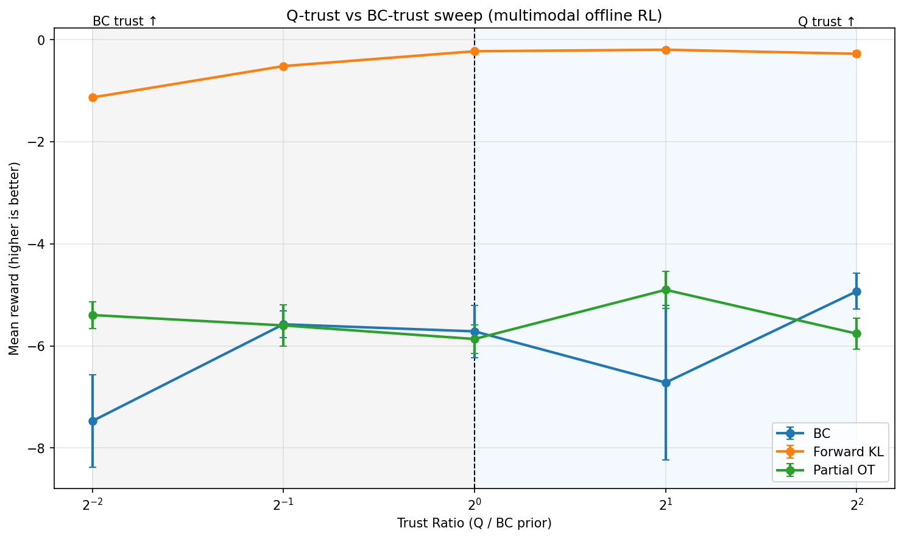
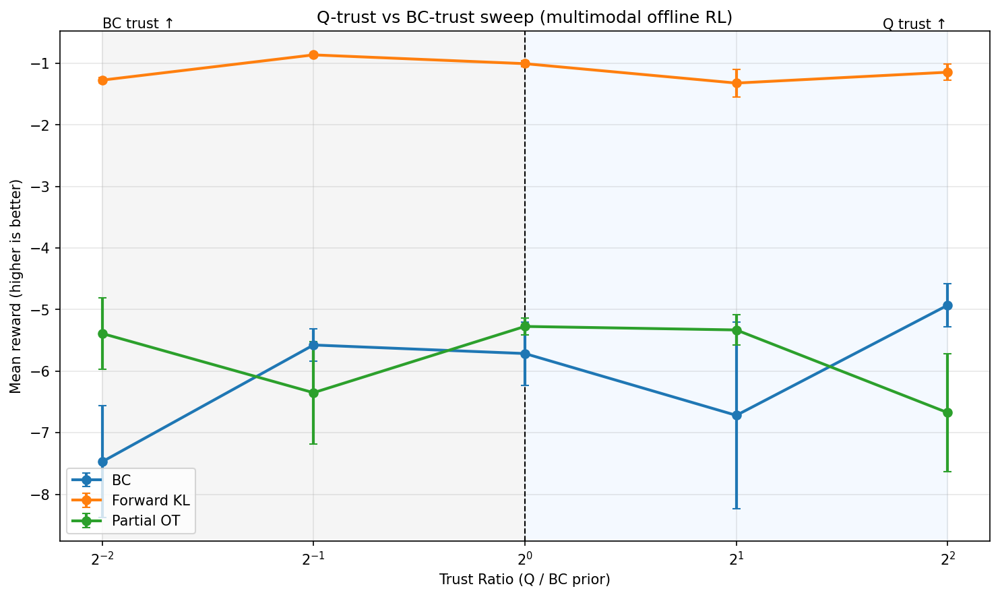
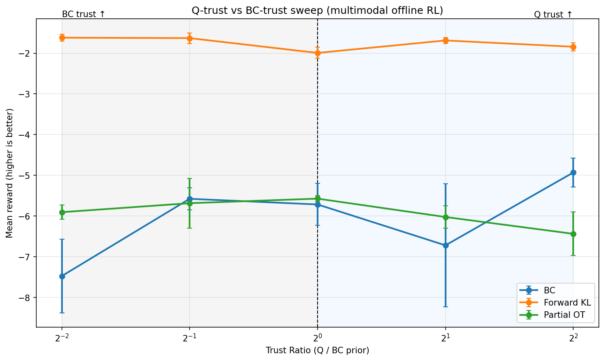

### B. Lambda sweep: UOT overtakes KL in high-noise low-SNR
From low-SNR, seeds=5 summaries:

| Setting | Forward KL | Reverse KL | OT method (best lambda) | Best OT mean | Gap vs Forward KL |
|---|---:|---:|---|---:|---:|
| q=3.0 (s5) | -0.9201 | -0.9791 | Wasserstein (0.3) | -1.3492 | -0.4291 |
| q=3.0 (s5) | -0.9201 | -0.9791 | Partial OT (0.3) | -1.2649 | -0.3449 |
| q=3.0 (s5) | -0.9201 | -0.9791 | Unbalanced OT (3.0) | -0.9314 | -0.0113 |
| q=6.0 (s5) | -1.0063 | -1.1123 | Wasserstein (3.0) | -1.3424 | -0.3361 |
| q=6.0 (s5) | -1.0063 | -1.1123 | Partial OT (0.1) | -1.1126 | -0.1063 |
| q=6.0 (s5) | -1.0063 | -1.1123 | **Unbalanced OT (0.1)** | **-0.8845** | **+0.1218** |

Interpretation:
- In q=6 low-SNR, UOT clearly beats both KL baselines.
- A natural explanation is that UOT’s soft marginal relaxation avoids over-matching low-quality mass.
- Balanced OT / strict mass matching can be too rigid under mixed-quality offline data.

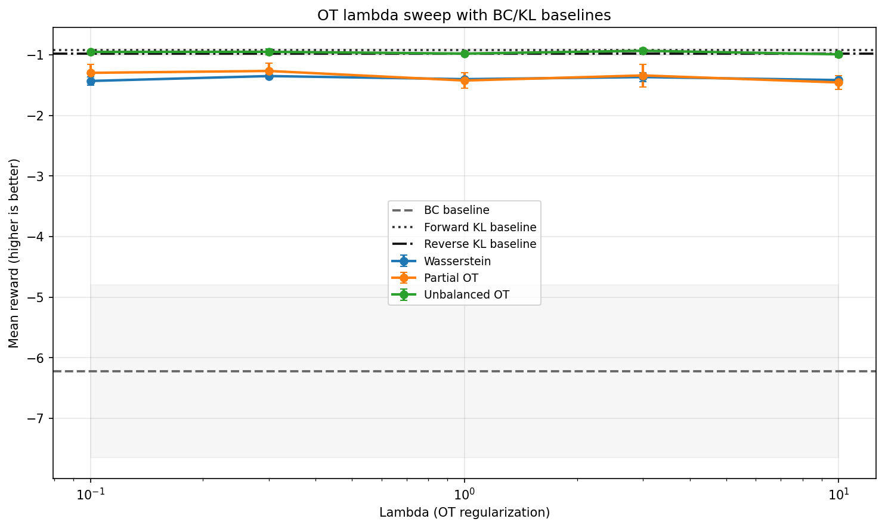
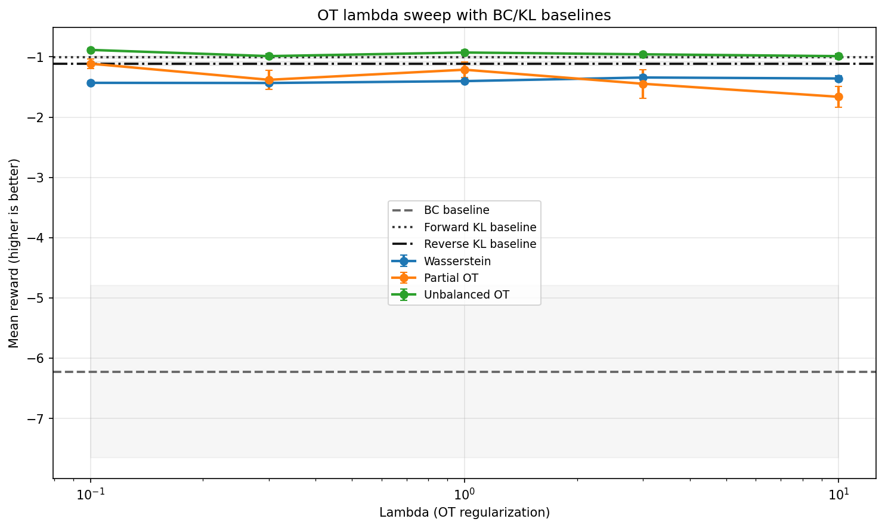

---

## 2) Likely Counterarguments and Preemptive Responses

### (i) "OT needs lambda tuning, so comparison is unfair"
Response:
- KL also needs trust-axis tuning (already shown by trust-ratio sweeps).
- Fair statement: both families require tuning; the optimum shifts with noise regime.
- Empirically, UOT tends to prefer smaller lambda in high-noise regimes.

### (ii) "Why only UOT is strong, not Wasserstein/POT?"
Response:
- This is evidence for mechanism, not a contradiction.
- Offline RL with mixed-quality demonstrations can punish hard/fully balanced transport.
- UOT’s soft marginal relaxation appears to provide the right inductive bias under heavy Q corruption.

---

## 3) Minimal-Cost Follow-Up Experiments (High Value)

### Experiment 1: Measure actual Q quality vs performance
Goal:
- Replace "noise level" proxy with measured Q reliability.

Minimal additions:
- Log Q RMSE (or ranking consistency/top-k overlap) on holdout actions.
- Plot `performance vs Q-error` for KL and OT.

Expected payoff:
- Strong causal narrative: "as Q quality collapses, KL degrades and UOT becomes favorable."

### Experiment 2: Stress case where BC prior is wrong
Goal:
- Validate the opposite regime.

Minimal additions:
- Increase bad/suboptimal mode mass in behavior policy.
- Compare KL vs OT under the same training protocol.

Expected payoff:
- Shows bidirectional validity: OT is not universally better; dependence is on signal trustworthiness.

### Experiment 3: OT mechanism metrics (mass mismatch/outlier handling)
Goal:
- Make UOT’s win mechanistically explicit.

Minimal additions:
- Log transport/mismatch statistics per step or epoch:
  - effective transported mass,
  - dropped/relaxed mass,
  - cost contribution from far samples.

Expected payoff:
- Direct evidence that UOT gains by avoiding harmful mass matching in noisy regimes.

### Experiment 4: Best lambda vs Q noise scaling law
Goal:
- Turn findings into a practical tuning rule.

Minimal additions:
- Sweep `q_noise_std` over a wider grid (e.g., 0.5, 1, 2, 3, 4, 6, 8, 10).
- Record `best lambda` for each OT method.

Expected payoff:
- Actionable calibration guide for practitioners.

---

## 4) Precise Framing for the Paper/Presentation
Use this regime-aware wording:

- KL methods (especially Forward KL with Q-tilting) apply Q preferences exponentially, which is sample-efficient when Q is reliable but sensitive to Q errors.
- OT methods regularize policy updates by geometry/distributional matching to the behavior prior.
- Under severe Q corruption and mixed-quality offline data, UOT’s soft marginal relaxation is more robust than strict mass matching.
- Therefore, model selection is primarily a **trust-allocation problem between Q and BC prior**, not a universal KL-vs-OT dominance question.

---

## 5) Recommended Next Steps (Lowest Cost First)
1. Add Q-quality metrics and produce `performance vs Q-error` plot.
2. Run bad-prior stress test (increase suboptimal mode mass).
3. Add UOT transport/mismatch diagnostics.
4. Fit/plot best-lambda vs noise trend.

---

## Visual Appendix (Non-heatmap comparisons)

### Grouped bars + baseline lines
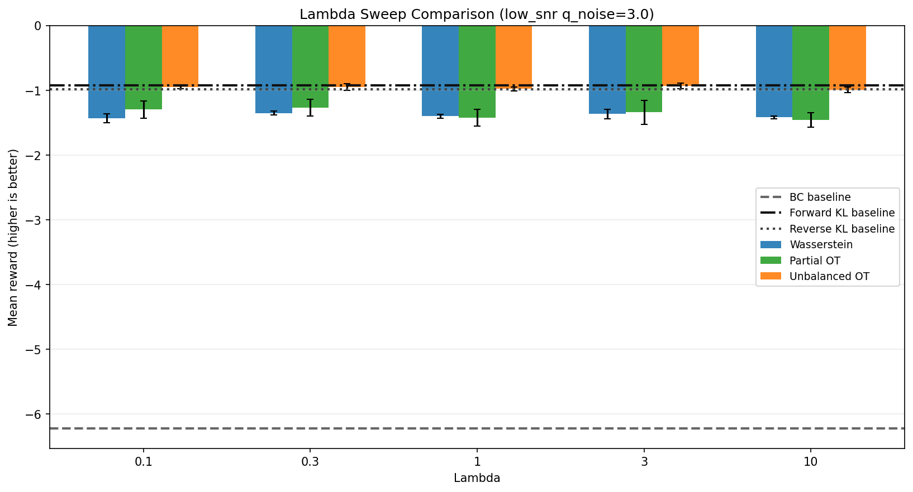
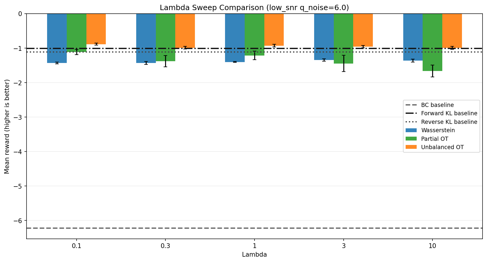

### Seed-level spread at best lambda
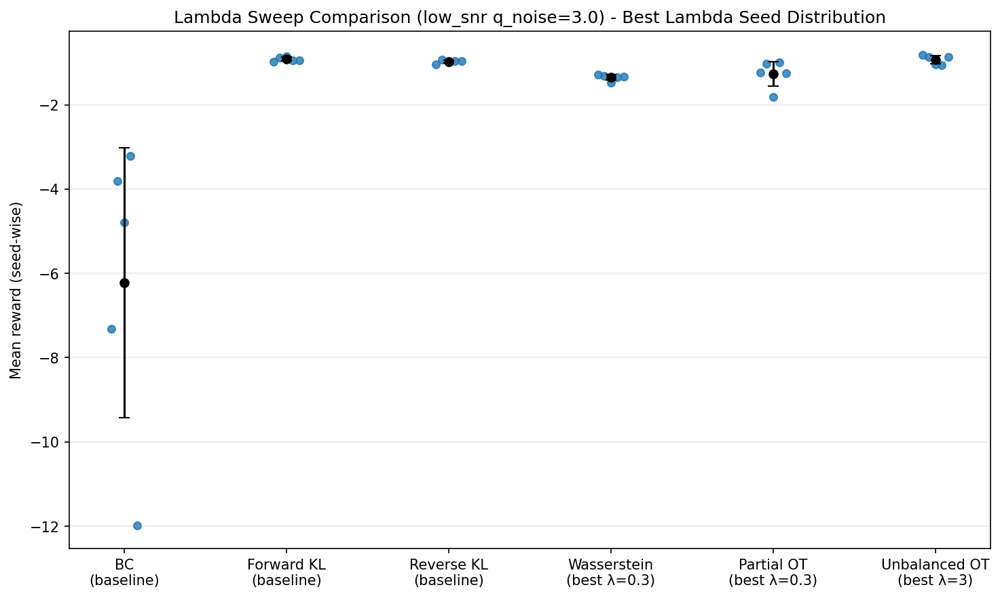
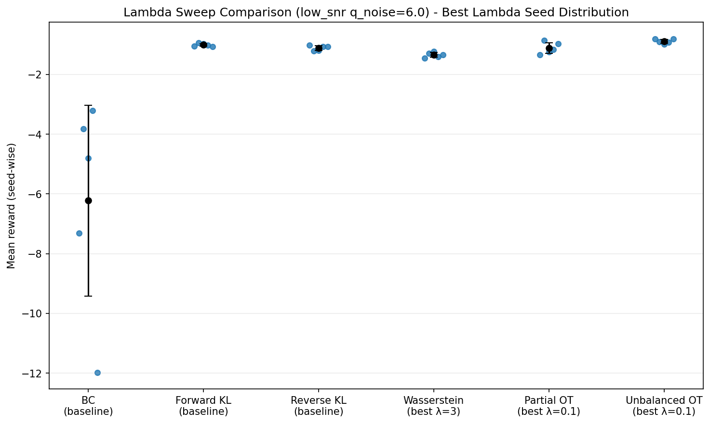

### Reward-free-comparison-style snapshots (best OT lambdas)
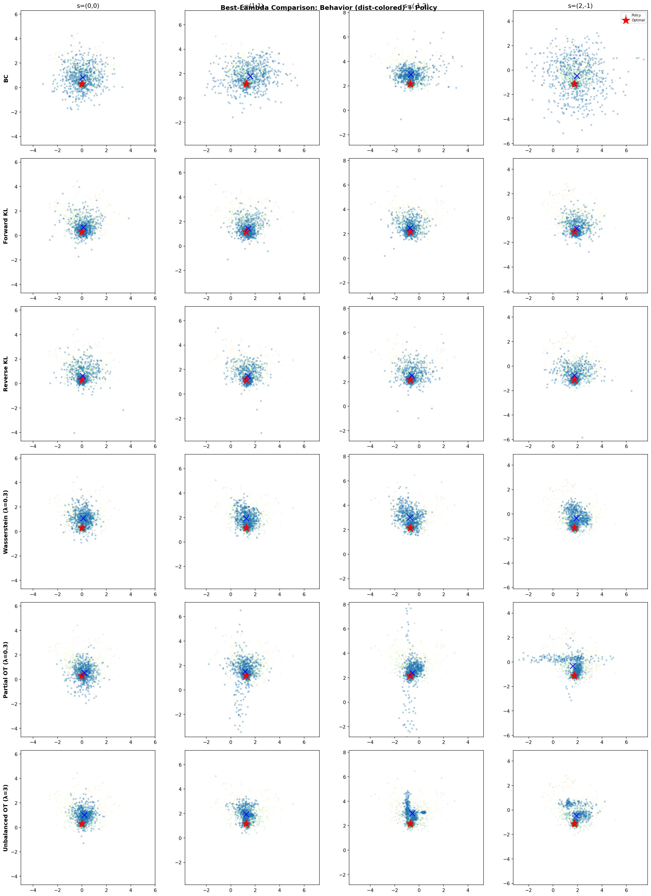
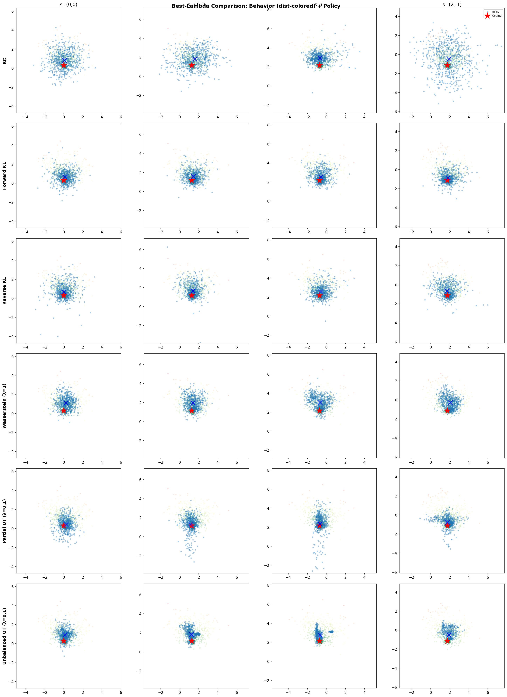

---

## Source Files
- `results/hypothesis_trust_best_by_noise.csv`
- `results/lambda_sweep_low_snr_transition.csv`
- `results/lambda_sweep_all6_low_snr_q3_s5_summary.csv`
- `results/lambda_sweep_all6_low_snr_q6_s5_summary.csv`
