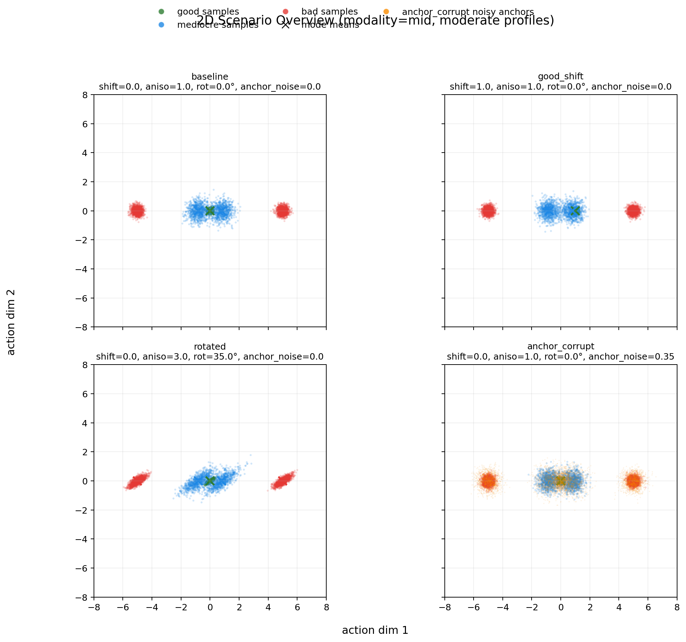

# OfflineRL Toy Reboot: 4-Axis Results (Balanced)

This README summarizes the completed reboot run on **March 4, 2026**.

- Main runner: `scripts/run_experiment.py`
- Final prefix: `regime_4axis_scenario_balanced`
- Full grid: `results/regime_4axis_scenario_balanced_grid.csv`

## 1) Four Axes (explicit list)

1. `scenario` (moderate profile)
- `baseline`
- `good_shift`
- `rotated`
- `anchor_corrupt`

2. `modality`
- `low`
- `mid`
- `high`

3. `Q quality`
- `clean`
- `mid`
- `noisy`

4. `action dimension`
- `2`
- `4`
- `8`

Total cells:
- `4 x 3 x 3 x 3 = 108`

## 2) What Each Scenario Means

All scenario knobs are applied on top of the same multimodal behavior template.

| Scenario | Knobs | Meaning |
|---|---|---|
| `baseline` | `mean_shift=0.0`, `reward_center_shift=0.0`, `anisotropy_ratio=1.0`, `rotation_deg=0.0`, `l2_anchor_noise_std=0.0` | Reference setting. No geometric distortion, no anchor corruption. |
| `good_shift` | `mean_shift=+1.0` (first action axis), others same as baseline | Moves the good mode center away from the origin along axis-1. Tests robustness when behavior geometry is shifted. |
| `rotated` | `anisotropy_ratio=3.0`, `rotation_deg=35.0` (first two axes), others baseline | Applies anisotropic covariance + rotation to behavior sampling noise. Tests geometry mismatch and directional coupling effects. |
| `anchor_corrupt` | `l2_anchor_noise_std=0.35`, others baseline | Corrupts only the L2 anchor (`a_beta + sigma*noise`). Tests sensitivity of direct L2 anchoring. |

### 2D sketch (quick intuition)

`results/scenario_2d_overview_moderate.png`



## 3) Other Axis Profiles Used

### Modality profiles

| Modality | Offsets `(mediocre,bad)` | Stds `(good,mediocre,bad)` | Weights `(good, med+, med-, bad+, bad-)` |
|---|---|---|---|
| `low` | `(0.4, 2.5)` | `(0.12, 0.50, 0.50)` | `(0.45, 0.225, 0.225, 0.05, 0.05)` |
| `mid` | `(0.8, 5.0)` | `(0.10, 0.40, 0.20)` | `(0.20, 0.15, 0.15, 0.25, 0.25)` |
| `high` | `(1.0, 6.0)` | `(0.08, 0.35, 0.15)` | `(0.10, 0.10, 0.10, 0.35, 0.35)` |

### Q-quality profiles

| Q quality | `q_noise_std` | `q_bias_bad` | `bad_spike_prob` | `bad_spike_value` |
|---|---:|---:|---:|---:|
| `clean` | 0.0 | 0.0 | 0.0 | 0.0 |
| `mid` | 2.0 | 0.3 | 0.0 | 0.0 |
| `noisy` | 5.0 | 1.0 | 0.01 | 10.0 |

## 4) Methods Compared

- `bc`
- `forward_kl`
- `wasserstein`
- `partial_ot` (potential-game replacement, PPL-style)
- `unbalanced_ot`
- `l2_constraint`

All policies in this toy are **state-free static diagonal Gaussian** policies.

## 5) Balanced Budget

- Seeds: `0,1,2`
- Epochs: `30`
- Dataset size: `15000`
- Dimensions: `2,4,8`

## 6) Final Results (108 Cells)

### Overall summary

| Metric | Value |
|---|---:|
| Mean `best_ot_minus_kl` | `+0.1548` |
| Mean `best_l2_minus_kl` | `+0.1553` |
| Mean `best_pot_minus_kl` | `+0.0606` |
| Cells where `UOT > KL` | `68 / 108` |
| Cells where `L2 > KL` | `68 / 108` |
| Cells where `all_ot_beat_kl = 1` | `59 / 108` |
| Best constrained winner count: `l2_constraint` | `68` |
| Best constrained winner count: `unbalanced_ot` | `40` |
| Best constrained winner count: `wasserstein`, `partial_ot` | `0`, `0` |

### By scenario (27 cells each)

| Scenario | `UOT > KL` | `L2 > KL` | Mean `best_ot - KL` | Mean `best_l2 - KL` |
|---|---:|---:|---:|---:|
| `baseline` | 14 | 14 | `+0.0361` | `+0.0365` |
| `good_shift` | 27 | 27 | `+0.4951` | `+0.4958` |
| `rotated` | 13 | 13 | `+0.0405` | `+0.0410` |
| `anchor_corrupt` | 14 | 14 | `+0.0474` | `+0.0480` |

### By Q quality (36 cells each)

| Q quality | `UOT > KL` | `L2 > KL` | Mean `best_ot - KL` | Mean `best_l2 - KL` |
|---|---:|---:|---:|---:|
| `clean` | 9 | 9 | `-0.0776` | `-0.0779` |
| `mid` | 23 | 23 | `+0.1490` | `+0.1489` |
| `noisy` | 36 | 36 | `+0.3929` | `+0.3950` |

### By action dimension (36 cells each)

| Dimension | `UOT > KL` | `L2 > KL` | Mean `best_ot - KL` | Mean `best_l2 - KL` |
|---|---:|---:|---:|---:|
| `2` | 27 | 27 | `+0.1963` | `+0.1965` |
| `4` | 23 | 23 | `+0.1694` | `+0.1703` |
| `8` | 18 | 18 | `+0.0985` | `+0.0991` |

## 7) Detailed Interpretation

1. `Q clean`에서는 KL이 대체로 유리하다.
- `clean`에서 constrained 계열의 평균 이득은 음수(`best_ot_minus_kl < 0`).
- 즉 Q 신뢰도가 충분하면 KL의 Q-tilting이 효율적이라는 기존 가설과 일치한다.

2. `Q noisy`에서는 constrained 계열이 일관되게 유리하다.
- `noisy`에서 `UOT > KL`이 `36/36`.
- Q misranking/noise가 커질수록 KL의 exponential reweighting 취약성이 커진다는 해석과 정합적이다.

3. `baseline` vs `rotated`는 결과 패턴이 매우 비슷하다.
- 둘 다 평균 개선폭이 약 `+0.04` 수준.
- 이 moderate 회전/비등방 설정만으로는 Q-quality 축 효과를 뒤집을 만큼 크지 않았다.

4. `good_shift`는 가장 강한 분리 시나리오였다.
- `UOT > KL`, `L2 > KL` 모두 `27/27`.
- 평균 개선폭도 `~+0.50`으로 압도적.

5. L2와 UOT의 차이는 매우 작다.
- 평균 `(L2 - UOT)`은 `+0.00058`.
- 모든 셀에서 `|L2 - UOT| < 0.005`.
- 이 실험군에서는 “L2 우위”라기보다 “L2와 UOT가 거의 동급”으로 보는 것이 안전하다.

## 8) Conclusion (When Each Method Wins)

1. **KL-favored regime**
- `Q quality = clean`이고 데이터/geometry 교란이 크지 않을 때.

2. **Constrained-favored regime (UOT/L2)**
- `Q quality = mid/noisy`일 때.
- 특히 `noisy`에서는 KL 대비 robust한 성능 우위를 거의 항상 보였다.

3. **Practical takeaway**
- “KL vs OT는 절대 우열”이 아니라 “신뢰할 신호(Q vs behavior prior)의 비율 문제”라는 메시지를 지지한다.
- 다만 본 실험에서는 UOT와 L2가 거의 동일하게 잘 동작했으므로, OT만의 고유 이점이라고 단정하기는 어렵다.

## 9) How Much To Trust These Results

### What is reliable

1. `Q-quality` 축의 경향성.
- `clean -> mid -> noisy`로 갈수록 constrained 계열 상대 이득이 커지는 방향은 매우 일관적이다.

2. KL의 취약 구간.
- 강한 Q 오염(`noisy`)에서 KL이 밀리는 패턴은 재현성이 높다.

### What is only moderately reliable

1. UOT vs L2의 “미세한 우열”.
- 차이가 매우 작고(대부분 1e-3 수준), 해석은 민감하다.

2. 차원 효과의 절대 크기.
- `dim=2,4,8`에서 개선폭이 감소하는 경향은 보이지만, 이 toy 설계와 예산에 종속적일 수 있다.

### Hard limits (do not over-claim)

1. 단일 상태 bandit toy이다.
- 실제 offline RL의 장기 크레딧 할당/동역학 불확실성을 반영하지 않는다.

2. 정책 클래스가 단순하다.
- state-dependent policy가 아니라 static diagonal Gaussian 정책이다.

3. 람다 스윕 기반의 oracle 비교다.
- 각 셀에서 최적 람다를 고르는 방식이라 실전 단일 하이퍼파라미터 고정보다 유리할 수 있다.

4. 시드 수가 작다.
- `3 seeds` 기준이며, 미세한 차이는 쉽게 뒤집힐 수 있다.

### Simple uncertainty proxy

- 평균 seed-std (best-point 기준): `KL≈0.0268`, `UOT≈0.0024`, `L2≈0.0021`
- 개선폭이 RSS std를 넘는 셀 수:
  - `UOT > KL`: `67/108`
  - `L2 > KL`: `67/108`
- Q 품질별(`UOT > KL`, same for L2):
  - `clean`: `9/36`
  - `mid`: `22/36`
  - `noisy`: `36/36`

## 10) Repro Command

```bash
python3 scripts/run_experiment.py --mode full4 \
  --base-config configs/ot_wins_dim_sweep.yaml \
  --dims 2,4,8 \
  --seeds 0,1,2 \
  --epochs 30 \
  --n-data 15000 \
  --scenarios baseline,good_shift,rotated,anchor_corrupt \
  --output-prefix regime_4axis_scenario_balanced
```
