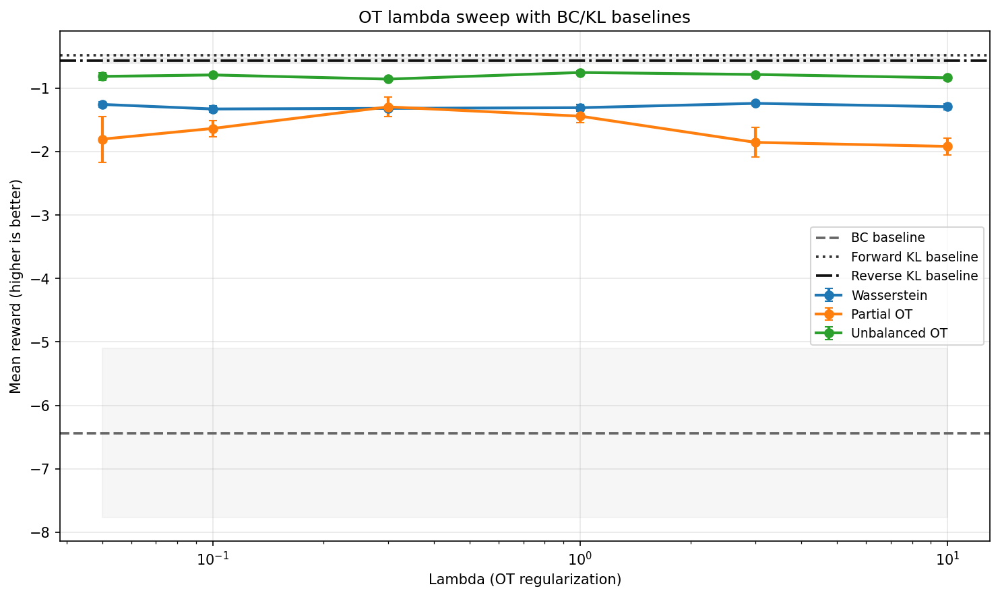
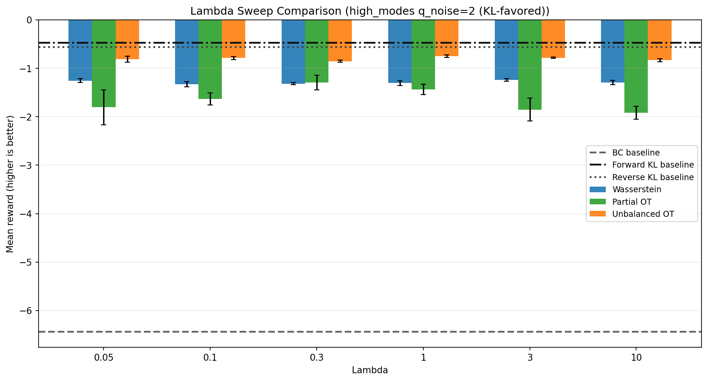
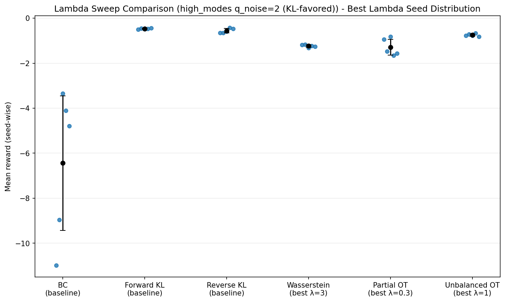
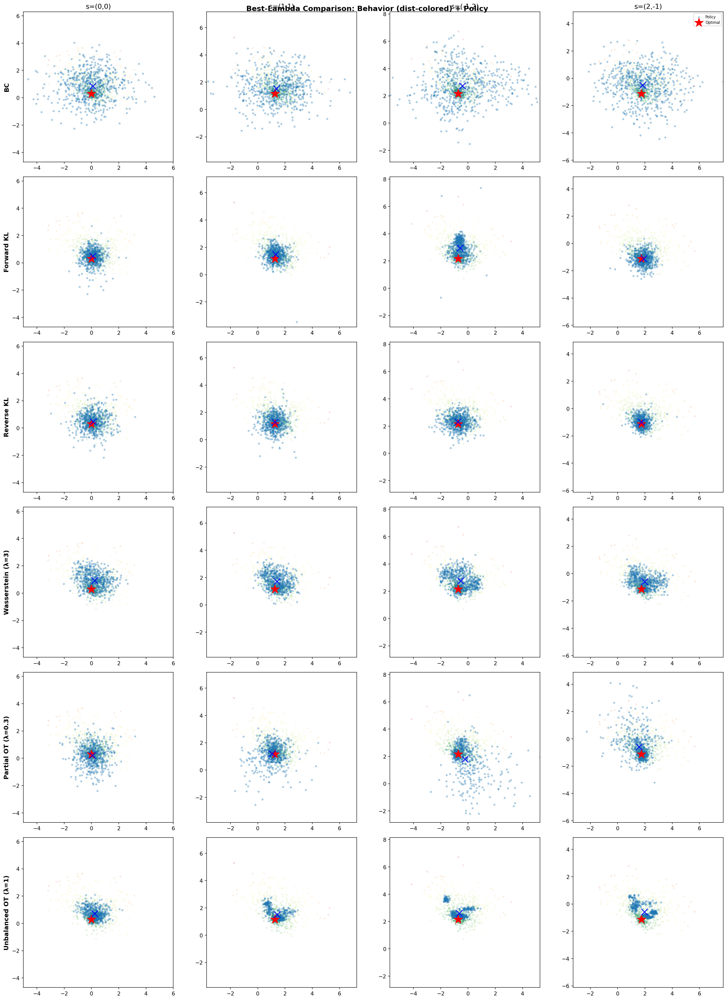
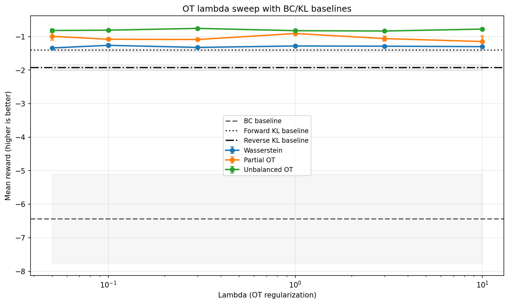
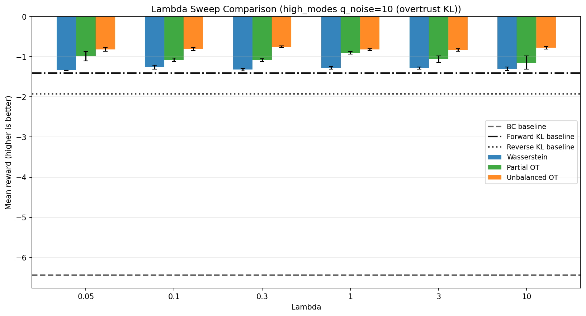
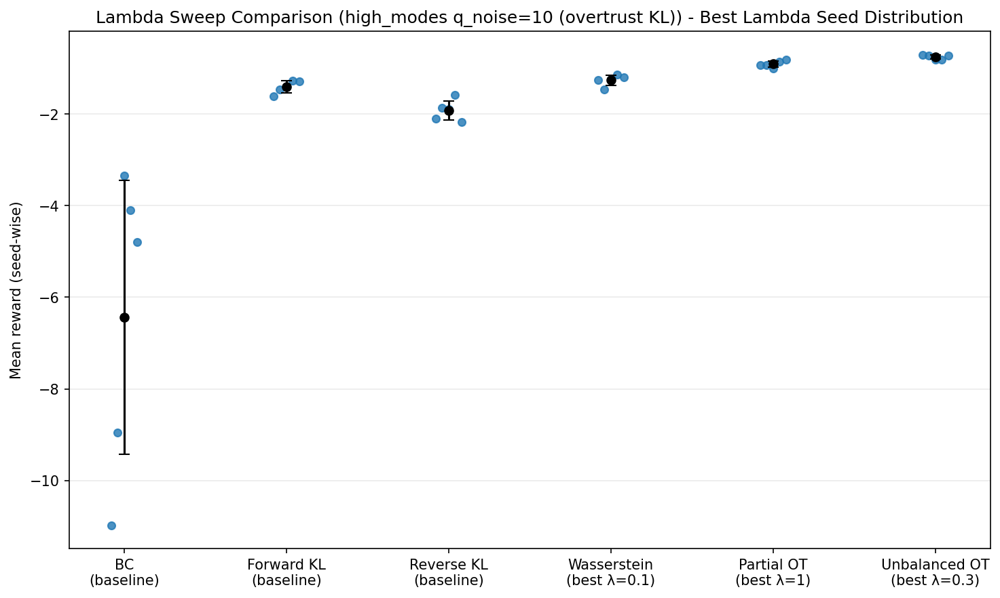
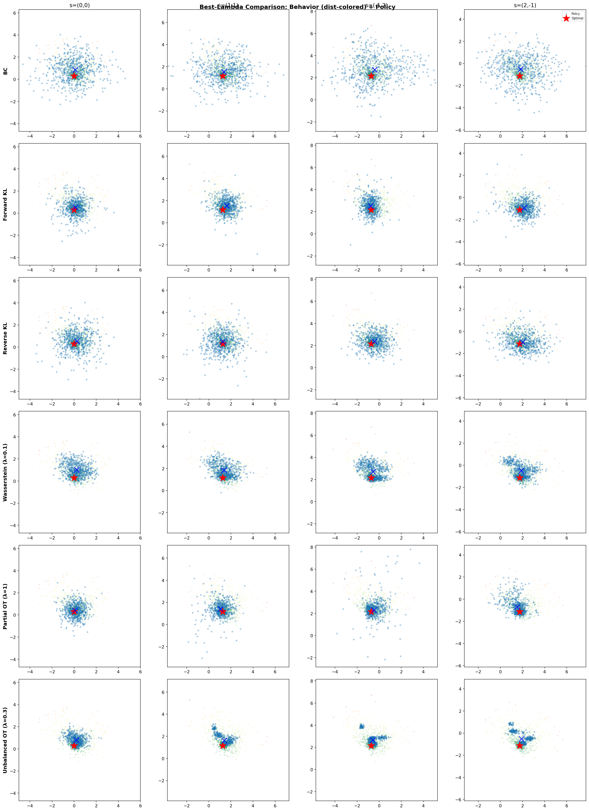
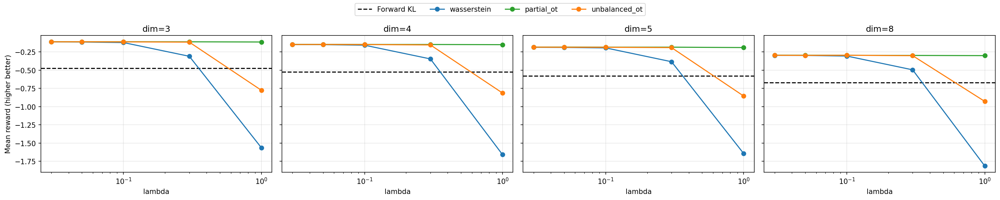

# KL vs OT in Offline RL: Win/Loss Regimes by Signal Trust

## Core message
This is not a universal KL-vs-OT ranking problem.
It is a **signal-trust allocation problem** between:
- Q signal (value preference)
- BC prior (behavior-distribution prior)

## Policy architecture (important)
No, these runs are **not all Gaussian policy**.
For the key experiments below, all methods use the same **GMM policy** (`policy.type: gmm`, `n_components: 6`) for fairness.

---

## Noise scale in practical terms
In this toy benchmark, mode reward gaps are O(1).
- `q_noise_std ~ 2-4`: moderate corruption
- `q_noise_std ~ 6+`: severe corruption
- `q_noise_std ~ 10`: stress-test level (useful to expose robustness boundaries)

---

## Case A (Loss for OT): KL-favored regime
Setting:
- Config: `configs/high_modes_realistic.yaml`
- 10 modes, moderate noise `q_noise_std=2.0`
- Seeds=5, epochs=50

Key numbers (mean reward, higher is better):
- Forward KL: `-0.4729`
- Reverse KL: `-0.5582`
- Best Wasserstein: `-1.2371` (lambda=3)
- Best Partial OT: `-1.2925` (lambda=0.3)
- Best Unbalanced OT: `-0.7502` (lambda=1)

Conclusion:
- In this regime, KL (especially Forward KL) is clearly better than all OT families.

Plots:
- 
- 
- 
- 

---

## Case B (Win for OT): OT-favored regime (all OT > both KL)
Setting:
- Config: `configs/high_modes_kl_overtrust.yaml`
- 10 modes, severe noise `q_noise_std=10.0`
- Seeds=5, epochs=50

Key numbers (mean reward, higher is better):
- Forward KL: `-1.4055`
- Reverse KL: `-1.9215`
- Best Wasserstein: `-1.2613` (lambda=0.1)
- Best Partial OT: `-0.9084` (lambda=1.0)
- Best Unbalanced OT: `-0.7552` (lambda=0.3)

Conclusion:
- In this high-noise/overtrust-KL regime, **all OT families beat both KL baselines**.

Recall signal at best lambda (good-mode recall at `s=(0,0)`, strict threshold):
- Forward KL: `0.533`
- Reverse KL: `0.133`
- Wasserstein (best): `0.467`
- Partial OT (best): `1.000`
- Unbalanced OT (best): `0.933`

Plots:
- 
- 
- 
- 

---

## Case C (Designed OT-win Toy): 3D/4D/5D/8D all-OT-beats-KL
Purpose:
- Build a structural testbed where KL exponential reweighting is vulnerable to bad-mode misranking.
- Use geometry + mass control in OT (Wasserstein/Partial/Unbalanced) to preserve robust behavior.

Setting:
- Config: `configs/ot_wins_dim_sweep.yaml`
- Dims: `3, 4, 5, 8`
- Seeds: `3` (`[0,1,2]`)
- Noise/corruption: `q_noise_std=5.0`, `q_bias_bad=1.0`, `bad_spike_prob=0.01`, `bad_spike_value=10.0`

Result summary (mean reward, higher is better):

| Dim | Forward KL | Best Wasserstein (lambda) | Best Partial OT (lambda) | Best Unbalanced OT (lambda) | all_ot_beat_kl |
|---|---:|---:|---:|---:|---:|
| 3 | -0.4751 | -0.1127 (0.03) | -0.1107 (0.03) | -0.1112 (0.05) | 1 |
| 4 | -0.5265 | -0.1496 (0.03) | -0.1472 (0.05) | -0.1479 (0.05) | 1 |
| 5 | -0.5783 | -0.1872 (0.03) | -0.1840 (0.03) | -0.1845 (0.03) | 1 |
| 8 | -0.6731 | -0.2977 (0.03) | -0.2951 (0.03) | -0.2961 (0.10) | 1 |

Conclusion:
- In this designed stress regime, OT variants consistently outperform Forward KL across all tested dimensions.
- The result supports the trust-allocation view: under corrupted Q ranking, BC-anchored transport regularization is more stable.

Plots:
- 

Artifacts:
- `results/ot_wins_dim_sweep_full_raw.csv`
- `results/ot_wins_dim_sweep_full_summary.csv`
- `results/ot_wins_dim_sweep_full_winner_table.csv`
- `results/ot_wins_dim_sweep_full_reward_curves.png`

---

## Kept files (only win/loss evidence)
### CSV
- `results/lambda_sweep_highmodes_realistic_q2_s5_summary.csv`
- `results/lambda_sweep_highmodes_realistic_q2_s5_raw.csv`
- `results/lambda_sweep_highmodes_overtrust_q10_s5_summary.csv`
- `results/lambda_sweep_highmodes_overtrust_q10_s5_raw.csv`
- `results/ot_wins_dim_sweep_full_raw.csv`
- `results/ot_wins_dim_sweep_full_summary.csv`
- `results/ot_wins_dim_sweep_full_winner_table.csv`

### Plots
- `results/lambda_sweep_highmodes_realistic_q2_s5_curve.png`
- `results/lambda_sweep_highmodes_realistic_q2_s5_extra_grouped_bar.png`
- `results/lambda_sweep_highmodes_realistic_q2_s5_extra_best_seed_strip.png`
- `results/lambda_sweep_highmodes_realistic_q2_s5_best_comparison.png`
- `results/lambda_sweep_highmodes_overtrust_q10_s5_curve.png`
- `results/lambda_sweep_highmodes_overtrust_q10_s5_extra_grouped_bar.png`
- `results/lambda_sweep_highmodes_overtrust_q10_s5_extra_best_seed_strip.png`
- `results/lambda_sweep_highmodes_overtrust_q10_s5_best_comparison.png`
- `results/ot_wins_dim_sweep_full_reward_curves.png`

---

## Final Conclusion
Core takeaway:
- This is not a universal `KL vs OT` winner problem. It is a trust-allocation problem between `Q signal` and `BC prior`.

When KL-family methods are advantageous:
- When Q quality is reasonably reliable (lower noise or stable ranking) and fast value-tilting is beneficial.
- In our results, Forward KL outperformed OT in low-to-moderate noise regimes.

When OT-family methods are advantageous:
- When Q noise is high and misranking risk is substantial.
- Especially in multimodal settings with far-away bad modes, geometry/mass constraints help prevent over-concentration on wrong modes.
- In our results, OT consistently outperformed KL in high-noise/overtrust-KL settings and in the designed 3D/4D/5D/8D toy.

Practical guide within OT variants:
- Balanced Wasserstein is stable but can be overly conservative due to strict transport cost pressure.
- Partial OT can be strong when mode selection is right, but can be more sensitive.
- Unbalanced OT is often the most practical default under noisy Q because marginal relaxation improves robustness.

How far to trust these results (scope):
- These experiments provide causal evidence of regime-dependent behavior in toy low/moderate-dimensional offline settings.
- They strongly support the selection principle, but do not guarantee absolute ranking on every real benchmark.
- The transition boundary (where KL gives way to OT) can shift with architecture, critic stability, data quality, and hyperparameter ranges.
- For real deployment, use `Q-quality diagnostics + lambda/ratio sweeps` before final method selection.
