# OfflineRL Toy Reboot: 3-Scenario Report (81 Cells)

This report is a filtered view of the same experiment assets, excluding contamination (`anchor_corrupt`) from the markdown conclusions.

- Main runner: `scripts/run_experiment.py`
- Result prefix: `regime_4axis_scenario_balanced`
- Main aggregate file: `results/regime_4axis_scenario_balanced_grid.csv`
- Report scope: `scenario in {baseline, good_shift, rotated}` only

## 1) Experiment Axes (Report Scope)

1. `scenario`: `baseline`, `good_shift`, `rotated`
2. `modality`: `low`, `mid`, `high`
3. `q_quality`: `clean`, `mid`, `noisy`
4. `action_dim`: `2`, `4`, `8`

Total reported cells:
- `3 x 3 x 3 x 3 = 81`

## 2) Scenario Definitions (Moderate Profile)

| Scenario | Parameters | Intended stress |
|---|---|---|
| `baseline` | `mean_shift=0.0`, `reward_center_shift=0.0`, `anisotropy_ratio=1.0`, `rotation_deg=0.0` | Reference regime with no geometric distortion. |
| `good_shift` | `mean_shift=+1.0`, others same as baseline | Shifts the good mode along action axis 1. |
| `rotated` | `anisotropy_ratio=3.0`, `rotation_deg=35.0`, others baseline | Applies anisotropic + rotated geometry (first two dimensions). |

## 3) 2D Scenario Sketch (No In-Image Titles)

### 2D Overview (`modality=mid`, `scenario_level=moderate`, 3 scenarios)

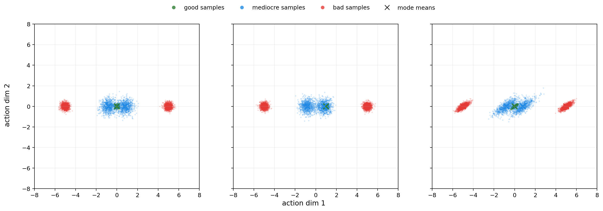

Panel order:
- Left: `baseline`
- Middle: `good_shift`
- Right: `rotated`

## 4) Modality and Q-Quality Profiles

### Modality profiles

| Modality | Offsets `(mediocre,bad)` | Stds `(good,mediocre,bad)` | Weights `(good, med+, med-, bad+, bad-)` |
|---|---|---|---|
| `low` | `(0.4, 2.5)` | `(0.12, 0.50, 0.50)` | `(0.45, 0.225, 0.225, 0.05, 0.05)` |
| `mid` | `(0.8, 5.0)` | `(0.10, 0.40, 0.20)` | `(0.20, 0.15, 0.15, 0.25, 0.25)` |
| `high` | `(1.0, 6.0)` | `(0.08, 0.35, 0.15)` | `(0.10, 0.10, 0.10, 0.35, 0.35)` |

### Q-quality profiles

| Q quality | `q_noise_std` | `q_bias_bad` | `bad_spike_prob` | `bad_spike_value` |
|---|---:|---:|---:|---:|
| `clean` | 0.0 | 0.0 | 0.0 | 0.0 |
| `mid` | 2.0 | 0.3 | 0.0 | 0.0 |
| `noisy` | 5.0 | 1.0 | 0.01 | 10.0 |

## 5) Methods Compared

- `bc`
- `forward_kl`
- `reverse_kl`
- `wasserstein`
- `partial_ot` (potential-game replacement, PPL-style)
- `unbalanced_ot`
- `l2_constraint`

Policy family in this toy:
- State-free static diagonal Gaussian policy.

Note:
- `reverse_kl` is wired into the runner and reward-curve plots.
- In reward-curve plots, dashed KL baseline label is per dimension:
- `KL best(f)` if forward KL is higher.
- `KL best(r)` if reverse KL is higher.

## 6) Budget and Outputs

Budget used:
- Seeds: `0,1,2`
- Epochs: `30`
- Dataset size: `15000`
- Dimensions: `2,4,8`

Main outputs:
- Grid CSV: `results/regime_4axis_scenario_balanced_grid.csv`
- Per-cell files: `*_raw.csv`, `*_summary.csv`, `*_winner_table.csv`, `*_reward_curves.png`
- Scenario-modality heatmaps: `*_heatmap_<scenario>_<modality>_pot.png`, `*_heatmap_<scenario>_<modality>_l2.png`

## 7) Quantitative Results (81 Cells)

Notation:
- `KL best(f)` = `forward_kl_mean_reward`
- `KL best(r)` = `reverse_kl_mean_reward`

### Forward KL vs Reverse KL (81-cell scope)

| Scope | `Forward > Reverse` | `Reverse > Forward` | Mean `(Forward - Reverse)` |
|---|---:|---:|---:|
| Overall (81) | `14` | `67` | `-0.0701` |
| `q=clean` (27) | `3` | `24` | `-0.0992` |
| `q=mid` (27) | `4` | `23` | `-0.0598` |
| `q=noisy` (27) | `7` | `20` | `-0.0514` |

### Overall

| Metric | Value |
|---|---:|
| Mean `best_ot_minus_kl` | `+0.1905` |
| Mean `best_l2_minus_kl` | `+0.1911` |
| Mean `best_pot_minus_kl` | `+0.0829` |
| Cells where `UOT > KL` | `54 / 81` |
| Cells where `L2 > KL` | `54 / 81` |
| Cells where `L2 > UOT` | `51 / 81` |
| Cells where `all_ot_beat_kl = 1` | `46 / 81` |
| Best constrained winner count: `l2_constraint` | `51` |
| Best constrained winner count: `unbalanced_ot` | `30` |
| Best constrained winner count: `wasserstein`, `partial_ot` | `0`, `0` |

### By scenario (27 cells each)

| Scenario | `UOT > KL` | `L2 > KL` | Mean `best_ot - KL` | Mean `best_l2 - KL` |
|---|---:|---:|---:|---:|
| `baseline` | 14 | 14 | `+0.0361` | `+0.0365` |
| `good_shift` | 27 | 27 | `+0.4951` | `+0.4958` |
| `rotated` | 13 | 13 | `+0.0405` | `+0.0410` |

### By Q quality (27 cells each)

| Q quality | `UOT > KL` | `L2 > KL` | Mean `best_ot - KL` | Mean `best_l2 - KL` |
|---|---:|---:|---:|---:|
| `clean` | 9 | 9 | `-0.0480` | `-0.0482` |
| `mid` | 18 | 18 | `+0.1945` | `+0.1944` |
| `noisy` | 27 | 27 | `+0.4251` | `+0.4272` |

### By action dimension (27 cells each)

| Dimension | `UOT > KL` | `L2 > KL` | Mean `best_ot - KL` | Mean `best_l2 - KL` |
|---|---:|---:|---:|---:|
| `2` | 21 | 21 | `+0.2213` | `+0.2215` |
| `4` | 18 | 18 | `+0.2039` | `+0.2048` |
| `8` | 15 | 15 | `+0.1464` | `+0.1469` |

### UOT vs L2 gap

| Metric | Value |
|---|---:|
| Mean `(best_l2_reward - best_uot_reward)` | `+0.00059` |
| Cells with `L2 > UOT` | `51` |
| Cells with `UOT > L2` | `30` |
| Cells with `|L2-UOT| < 0.005` | `81 / 81` |

### UOT vs L2 head-to-head by Q quality

| Q quality | `L2 > UOT` | `UOT > L2` | Mean `(L2 - UOT)` |
|---|---:|---:|---:|
| `clean` | `15` | `12` | `-0.00026` |
| `mid` | `11` | `16` | `-0.00016` |
| `noisy` | `25` | `2` | `+0.00218` |

### UOT vs L2 head-to-head by scenario

| Scenario | `L2 > UOT` | `UOT > L2` | Mean `(L2 - UOT)` |
|---|---:|---:|---:|
| `baseline` | `16` | `11` | `+0.00044` |
| `good_shift` | `19` | `8` | `+0.00085` |
| `rotated` | `16` | `11` | `+0.00047` |

### Wasserstein head-to-head (separate block)

#### Overall (81 cells)

| Pair | First > Second | Second > First | Mean `(First - Second)` |
|---|---:|---:|---:|
| `Wasserstein vs L2` | `0` | `81` | `-0.00357` |
| `Wasserstein vs UOT` | `5` | `76` | `-0.00299` |

#### By Q quality

| Q quality | `W > L2` | `L2 > W` | Mean `(W - L2)` | `W > UOT` | `UOT > W` | Mean `(W - UOT)` |
|---|---:|---:|---:|---:|---:|---:|
| `clean` | `0` | `27` | `-0.00326` | `2` | `25` | `-0.00353` |
| `mid` | `0` | `27` | `-0.00323` | `0` | `27` | `-0.00338` |
| `noisy` | `0` | `27` | `-0.00423` | `3` | `24` | `-0.00205` |

## 8) Analysis

1. KL is generally stronger in `clean` Q regimes.
- Average constrained gain is negative in `clean`.

2. Constrained methods dominate as Q corruption increases.
- In `noisy`, both `UOT > KL` and `L2 > KL` are `27/27`.

3. `good_shift` is the strongest constrained-win regime.
- Large positive gains for constrained methods versus KL.

4. L2 and UOT remain very close.
- Mean gap is small, but L2 is slightly favored in this filtered report.

5. Wasserstein is consistently below L2 and usually below UOT.

## 9) Conclusions

- The main message remains regime-dependent: trust Q more in clean regimes, trust constraints more in corrupted-Q regimes.
- In this 81-cell report, L2 and UOT are both strong; L2 is slightly ahead in win count.
- Wasserstein is weaker than both L2 and UOT under this setup.

## 10) Trust Scope and Limits

Reliable:
- Q-quality trend (`clean -> mid -> noisy`) is stable.
- KL weakness under strong corruption is consistent.

Moderate-confidence:
- Fine-grained UOT vs L2 ranking.
- Absolute size of dimension effects.

Hard limits:
1. Single-state toy bandit (not full MDP credit assignment).
2. Static diagonal Gaussian policy class.
3. Oracle-style lambda tuning per cell.
4. Only 3 seeds.

Uncertainty proxy (81-cell scope):
- Mean seed-std at best points: `KL≈0.0255`, `UOT≈0.00245`, `L2≈0.00220`
- Improvement above RSS std threshold:
- `UOT > KL`: `53/81`
- `L2 > KL`: `53/81`
- By Q quality (`UOT > KL`, same for L2):
- `clean`: `9/27`
- `mid`: `17/27`
- `noisy`: `27/27`

## 11) Heatmap Gallery (3 Scenarios)

### Scenario: `baseline`

#### `baseline / low / POT - KL`
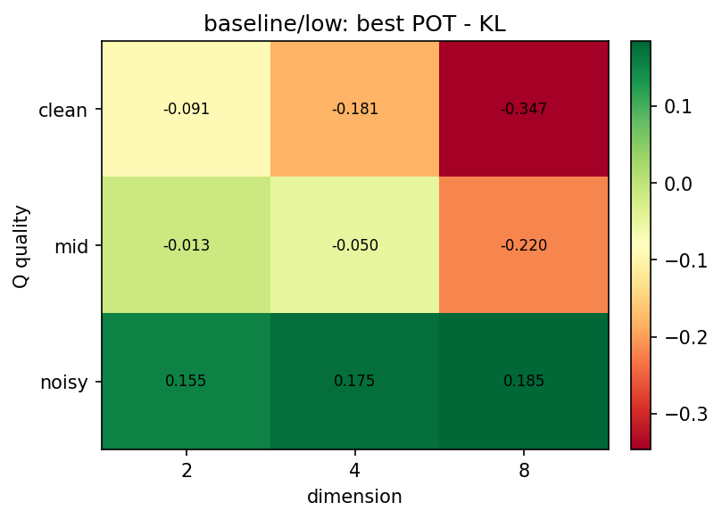

#### `baseline / low / L2 - KL`
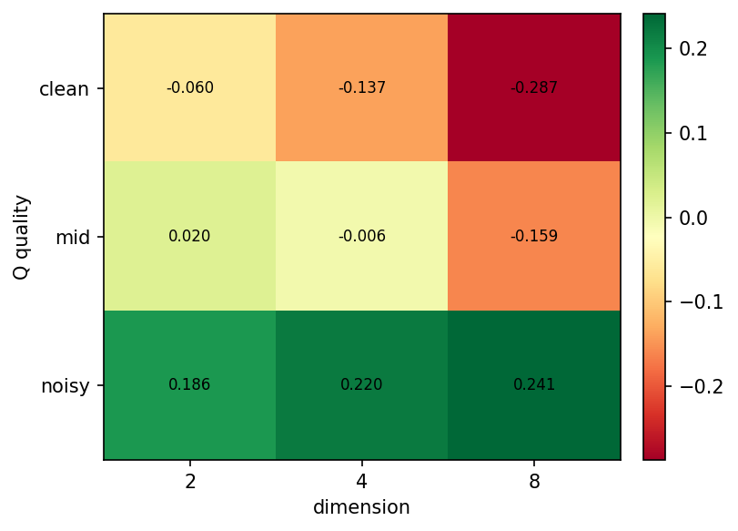

#### `baseline / mid / POT - KL`
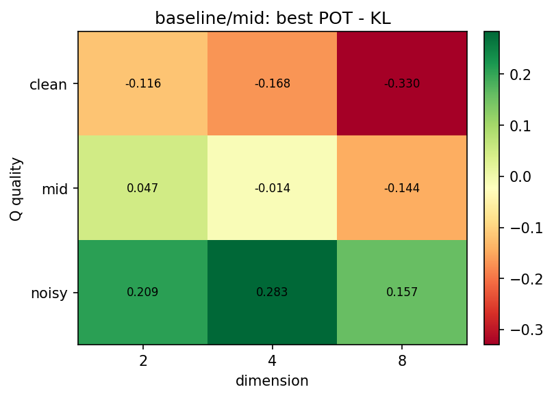

#### `baseline / mid / L2 - KL`
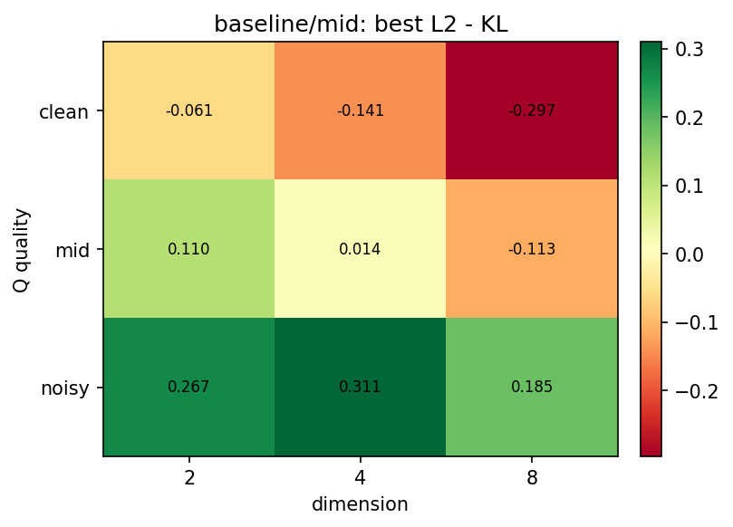

#### `baseline / high / POT - KL`
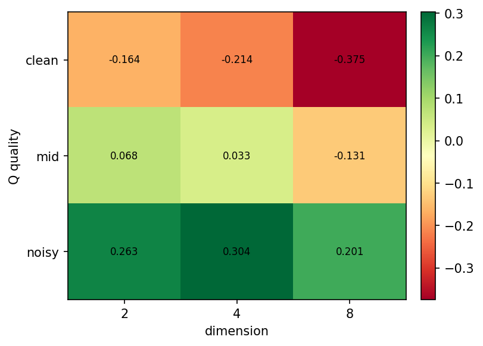

#### `baseline / high / L2 - KL`
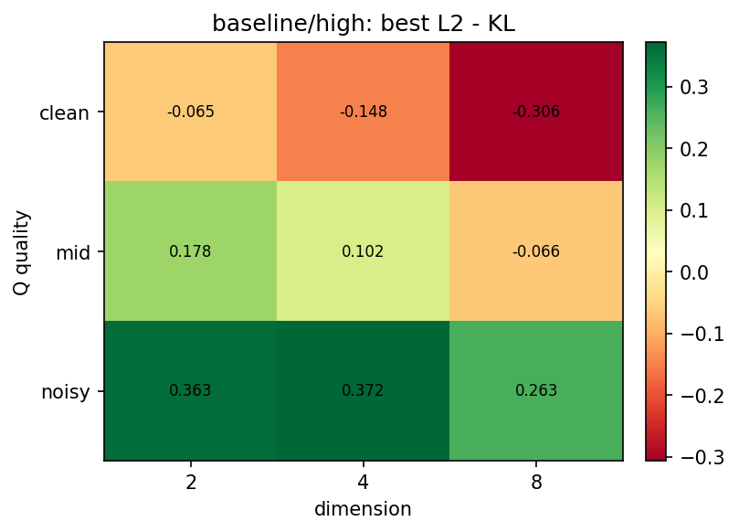

### Scenario: `good_shift`

#### `good_shift / low / POT - KL`
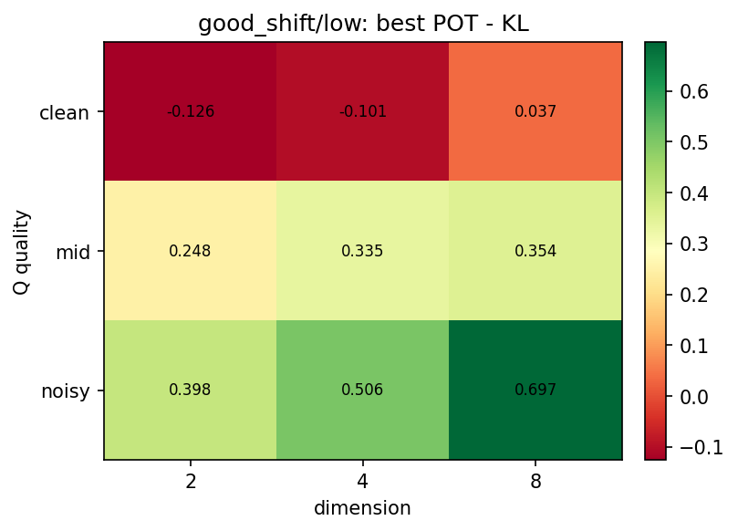

#### `good_shift / low / L2 - KL`
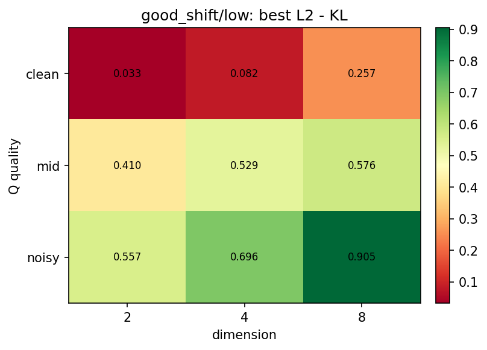

#### `good_shift / mid / POT - KL`
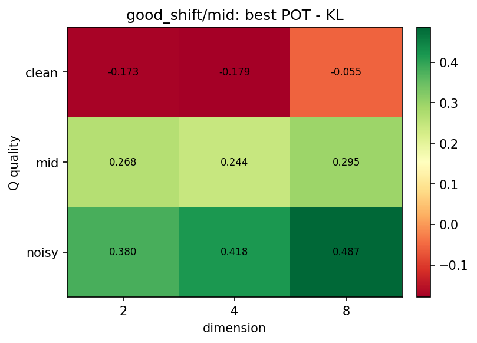

#### `good_shift / mid / L2 - KL`
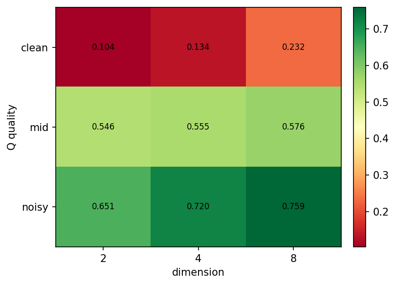

#### `good_shift / high / POT - KL`
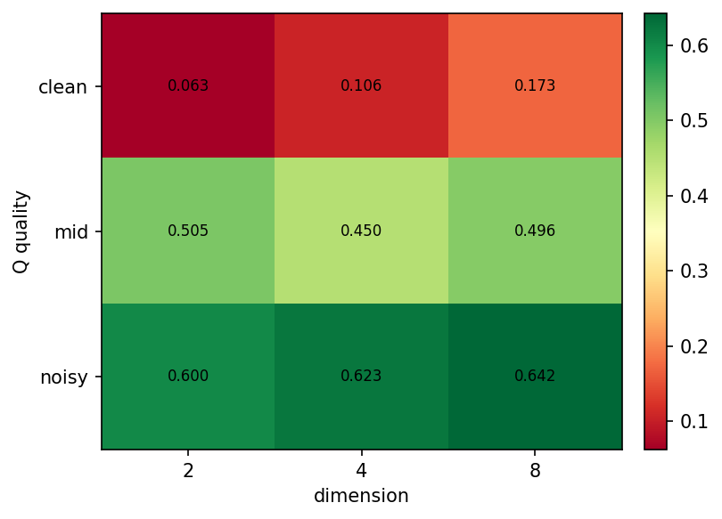

#### `good_shift / high / L2 - KL`
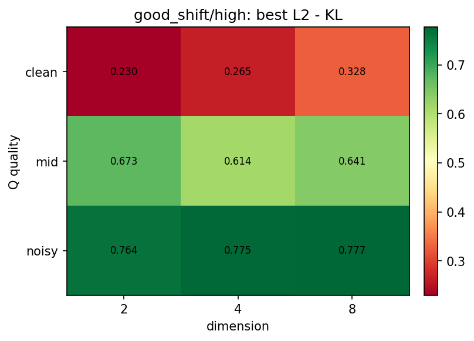

### Scenario: `rotated`

#### `rotated / low / POT - KL`
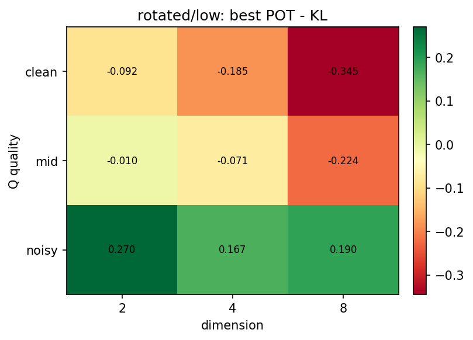

#### `rotated / low / L2 - KL`
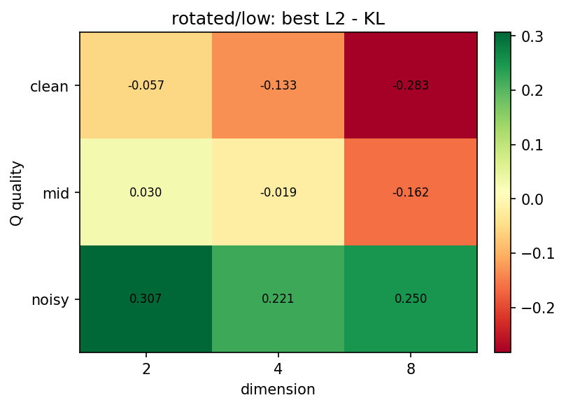

#### `rotated / mid / POT - KL`
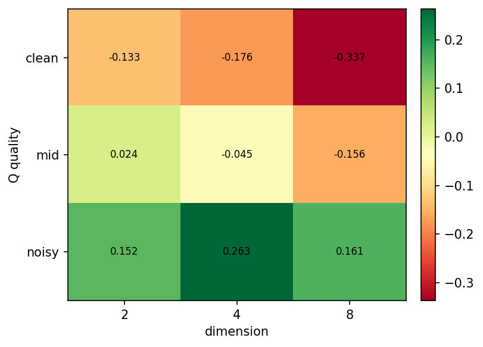

#### `rotated / mid / L2 - KL`
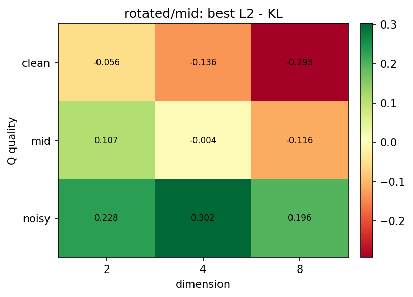

#### `rotated / high / POT - KL`
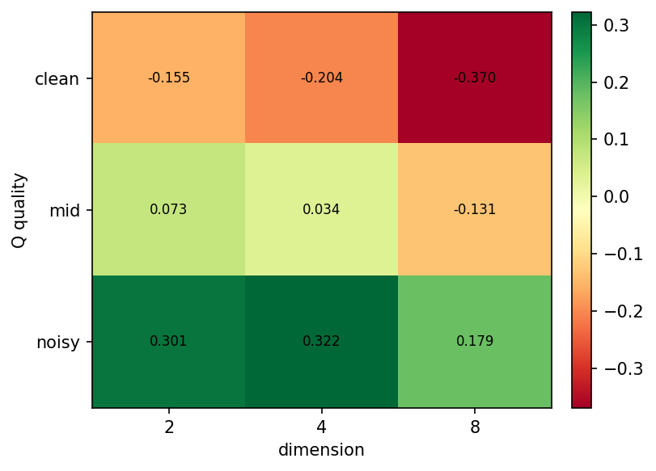

#### `rotated / high / L2 - KL`
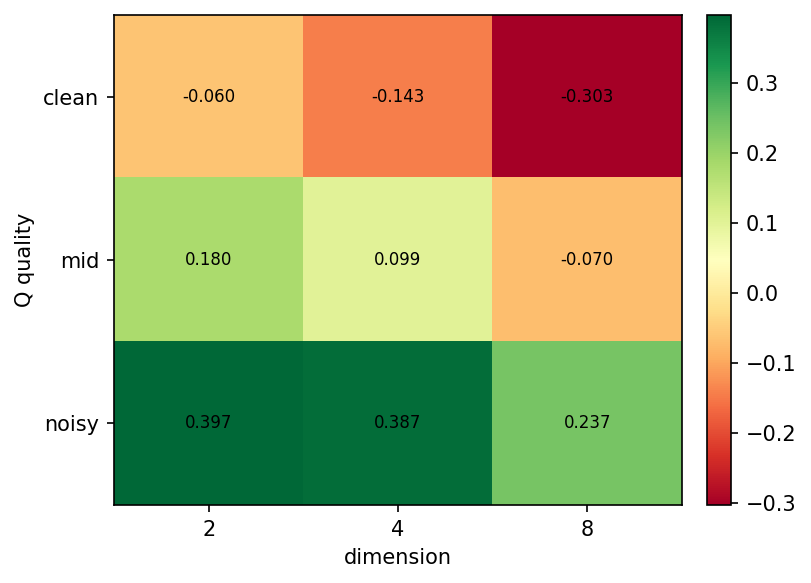

## 12) Reward Curve Index (27 Cells)

### `baseline`
- `low / clean`: [plot](results/regime_4axis_scenario_balanced_baseline_low_clean_reward_curves.png)
- `low / mid`: [plot](results/regime_4axis_scenario_balanced_baseline_low_mid_reward_curves.png)
- `low / noisy`: [plot](results/regime_4axis_scenario_balanced_baseline_low_noisy_reward_curves.png)
- `mid / clean`: [plot](results/regime_4axis_scenario_balanced_baseline_mid_clean_reward_curves.png)
- `mid / mid`: [plot](results/regime_4axis_scenario_balanced_baseline_mid_mid_reward_curves.png)
- `mid / noisy`: [plot](results/regime_4axis_scenario_balanced_baseline_mid_noisy_reward_curves.png)
- `high / clean`: [plot](results/regime_4axis_scenario_balanced_baseline_high_clean_reward_curves.png)
- `high / mid`: [plot](results/regime_4axis_scenario_balanced_baseline_high_mid_reward_curves.png)
- `high / noisy`: [plot](results/regime_4axis_scenario_balanced_baseline_high_noisy_reward_curves.png)

### `good_shift`
- `low / clean`: [plot](results/regime_4axis_scenario_balanced_good_shift_low_clean_reward_curves.png)
- `low / mid`: [plot](results/regime_4axis_scenario_balanced_good_shift_low_mid_reward_curves.png)
- `low / noisy`: [plot](results/regime_4axis_scenario_balanced_good_shift_low_noisy_reward_curves.png)
- `mid / clean`: [plot](results/regime_4axis_scenario_balanced_good_shift_mid_clean_reward_curves.png)
- `mid / mid`: [plot](results/regime_4axis_scenario_balanced_good_shift_mid_mid_reward_curves.png)
- `mid / noisy`: [plot](results/regime_4axis_scenario_balanced_good_shift_mid_noisy_reward_curves.png)
- `high / clean`: [plot](results/regime_4axis_scenario_balanced_good_shift_high_clean_reward_curves.png)
- `high / mid`: [plot](results/regime_4axis_scenario_balanced_good_shift_high_mid_reward_curves.png)
- `high / noisy`: [plot](results/regime_4axis_scenario_balanced_good_shift_high_noisy_reward_curves.png)

### `rotated`
- `low / clean`: [plot](results/regime_4axis_scenario_balanced_rotated_low_clean_reward_curves.png)
- `low / mid`: [plot](results/regime_4axis_scenario_balanced_rotated_low_mid_reward_curves.png)
- `low / noisy`: [plot](results/regime_4axis_scenario_balanced_rotated_low_noisy_reward_curves.png)
- `mid / clean`: [plot](results/regime_4axis_scenario_balanced_rotated_mid_clean_reward_curves.png)
- `mid / mid`: [plot](results/regime_4axis_scenario_balanced_rotated_mid_mid_reward_curves.png)
- `mid / noisy`: [plot](results/regime_4axis_scenario_balanced_rotated_mid_noisy_reward_curves.png)
- `high / clean`: [plot](results/regime_4axis_scenario_balanced_rotated_high_clean_reward_curves.png)
- `high / mid`: [plot](results/regime_4axis_scenario_balanced_rotated_high_mid_reward_curves.png)
- `high / noisy`: [plot](results/regime_4axis_scenario_balanced_rotated_high_noisy_reward_curves.png)

## 13) Reproduction Command (81-Cell Scope)

```bash
python3 scripts/run_experiment.py --mode full4 \
  --base-config configs/ot_wins_dim_sweep.yaml \
  --dims 2,4,8 \
  --seeds 0,1,2 \
  --epochs 30 \
  --n-data 15000 \
  --scenarios baseline,good_shift,rotated \
  --output-prefix regime_4axis_scenario_balanced
```
